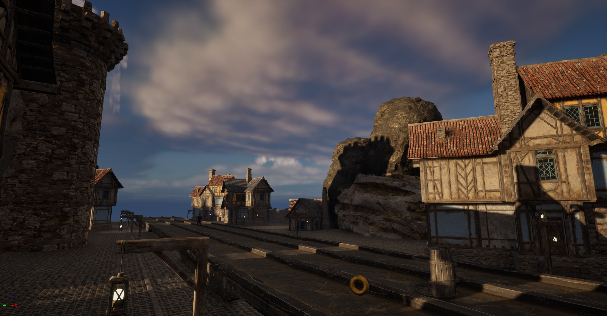

# Infinite Runner

## Download Project
If you want to test the game, please go to my itch.io page : [Al3xics](https://al3xics.itch.io/). Download the zip file named **"InfiniteRunner"**, decompress, and launch the .exe file. 
 

## Introduction
This project represents my first venture into Unreal Engine. Over the span of two weeks, I dedicated my time to familiarizing myself with Unreal Engine, understanding its intricacies, and implementing various features to create a basic endless runner game. 
 

## Project Timeline
- **Week 1**: During the initial week, I spent time comprehending the fundamentals of Unreal Engine by following tutorials provided by the instructor. This involved setting up the project, creating templates, and grasping the basic concepts for blueprint and C++. 
- **Week 2**: Building upon the knowledge gained in the first week, I continued to develop the project further. Despite encountering numerous challenges, including frequent crashes and unexpected issues with Unreal Engine, I persevered and successfully completed the project within the allotted time frame, albeit with some complexity. 

## Project Details
- **Solo Endeavor**: This project was undertaken individually, allowing me to navigate the complexities of game development at my own pace and tackle challenges autonomously. 
- **Feature Implementation**: 
  - **Decoration**: Added environmental elements to enhance the visual appeal of the game. 
  - **Random Mesh Selection**: Implemented a random selection of mesh for smalln medium and big obstacles to introduce variety. 
  - **Simultaneous Object Destruction**: Ensured that coins and objects are destroyed along with the tile to maintain game consistency. 
  - **Enhanced Jumping**: Increased the jump height to provide players with greater maneuverability. 
  - **Selective Obstacle Spawning**: Implemented spawning of obstacles only on two out of three lanes, reserving the third lane for coins. 
  - **Multiple Obstacle Rows**: Incorporated two rows of obstacles to introduce additional challenge and complexity. 
  - **Random Obstacle Rotation**: Added random rotation to obstacles upon spawning for added unpredictability. 
  - **Unique Obstacle (Cage) with Variations**: Introduced a new obstacle type (cage) with two variations and randomized rotation ranging from 90° to -90°. 
  - **Progressive Speed Increase**: Implemented a mechanic where the game speed gradually escalates, increasing the difficulty over time. 
  - **Slide Mechanism**: Added a sliding mechanic allowing the player to duck under obstacles or return to the ground mid-jump. 
  - **Slide Impact on Speed**: Ensured that the sliding action does not impact the player's speed, maintaining consistent gameplay dynamics. 
  - **Random Decor Spawning**: Integrated random spawning of decorative elements to diversify the game environment. 
  - **User Interface (UI)**: Designed and implemented user interface elements to provide essential feedback and information to the player. 
  - **Slide Jumping**: Enabled the player to execute a jump while sliding, providing additional tactical options during gameplay. 
  -  

Despite the challenges encountered, the project provided invaluable learning experiences and laid the groundwork for future endeavors in game development. 
 

### Have fun !! 
 

